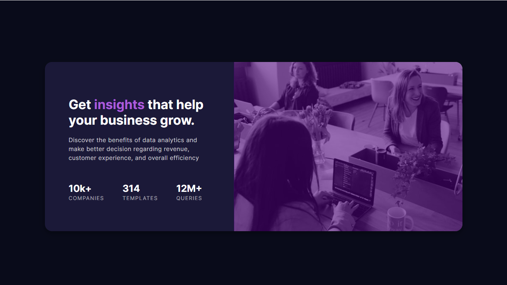
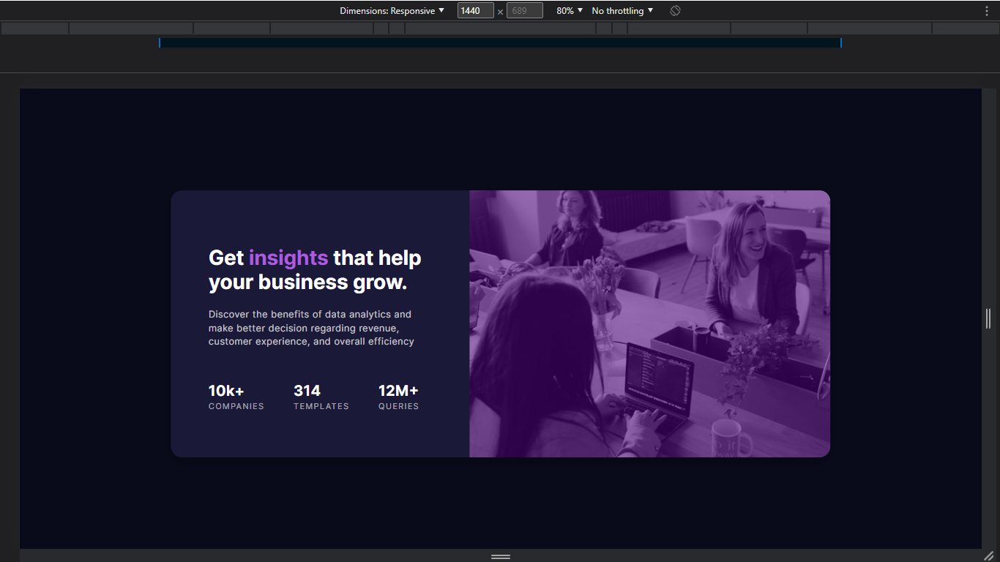
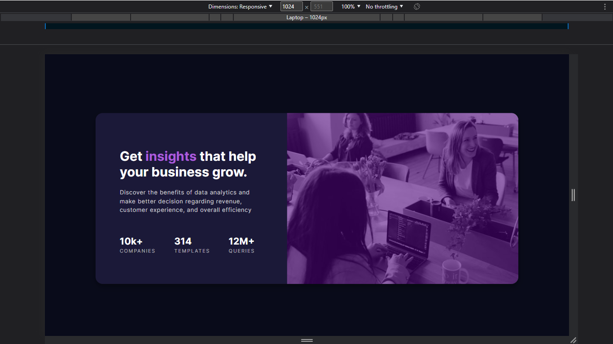
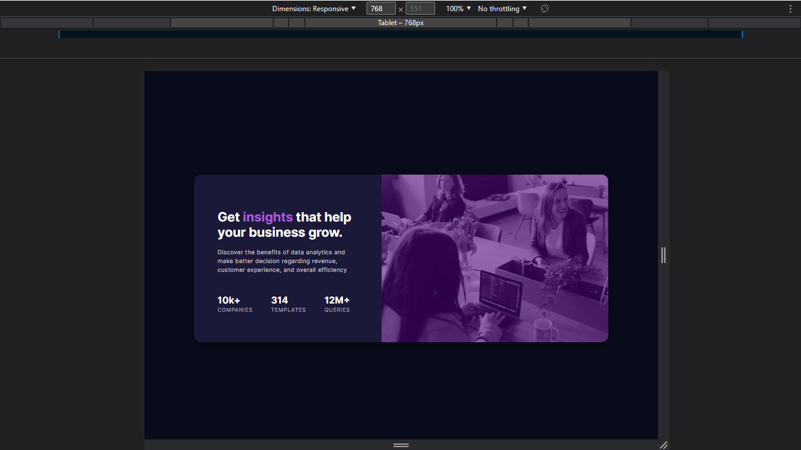
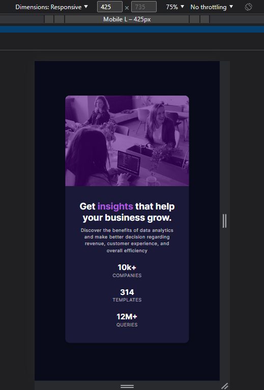
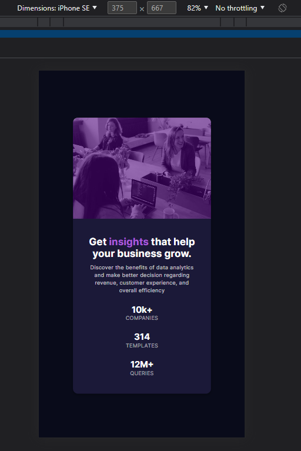
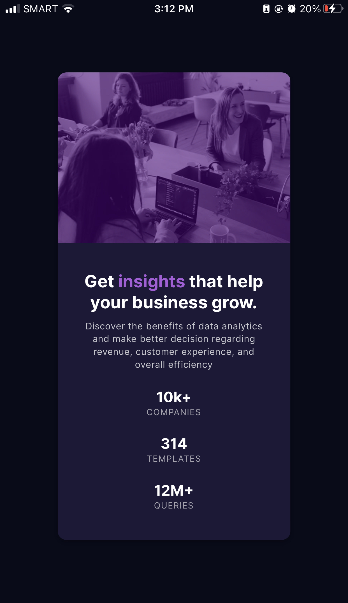

# Frontend Mentor - Stats preview card component solution

This is a solution to the [Stats preview card component challenge on Frontend Mentor](https://www.frontendmentor.io/challenges/stats-preview-card-component-8JqbgoU62). <br>
Frontend Mentor challenges help you improve your coding skills by building realistic projects. 

## Table of contents

- [Overview](#overview)
  - [The challenge](#the-challenge)
  - [Screenshot](#screenshot)
  - [Links](#links)
- [My process](#my-process)
  - [Built with](#built-with)
  - [What I learned](#what-i-learned)
  - [Continued development](#continued-development)
- [Author](#author)
- [Acknowledgments](#acknowledgments)


## Overview

### The challenge

Users should be able to:
- View the optimal layout depending on their device's screen size
- Get it looking as close to the design as possible.

### Screenshot

| Original View | Animated View | 
|---------|---------|
|  |  |

| Desktop View | Laptop View | Tablet View |
|---------|---------|---------|
|  |  |  |
|---------|---------|

| Mobile Large | Mobile Small (iPhone SE) | iPhone 8+ (Safari Browser) | iPhone 8+ (Brave Browser) |
|---------|---------|---------|---------|
|  |  |  | |

### Links
- Live Site URL: [Website Link - Click Me](X)
- Solution URL: [FrontEndMentor - Link](https://www.frontendmentor.io/solutions/qr-code-component-I0u3ok_Odp)

## My process

### Built with
- HTML, CSS 

### What I learned

Recap over some of the major learnings while working through this project:
- Basic review of HTML & CSS
- CSS Flex Layout (I've been a little bit better in using it)

<br>

This code snippets/function, if what I'm proud to accomplished:

```css
  display: flex;
  flex-direction: column;
  align-items: center;
  justify-content: center;
```

### Continued development
<hr>

#### Here are a few possible areas that could be added or improved in the HTML and CSS code you provided:
1. **Accessibility:** - It could be more accessible to users with disabilities by:
    - Include appropriate ARIA attributes, alt text, and semantic HTML tags. 
    - Also, providing a larger font size, better color contrast, and using aria-label, aria-roles attributes for the interactive elements.
2. **Responsiveness:** - Using responsive design techniques and media queries for different screen sizes and devices.

## Author
- Github - [@Iron-Mark](https://github.com/Iron-Mark)
- Frontend Mentor - [@Iron-Mark](https://www.frontendmentor.io/profile/Iron-Mark)

## Acknowledgments
- I would like to acknowledge the hard work and dedication that I went into creating this website. 
  - (I'm still recovering from fever doing this lol)
- I am grateful for my friends and to those who motivate me push through and not settle in relaxation. 
- I hope that this website serves its intended purpose. Thank you.

## Note:
- I would be happy to recieve comments, criticism, and such that could improve the website:
  - Better way of doing this website
  - Cleaner Code
  - Better Practice

