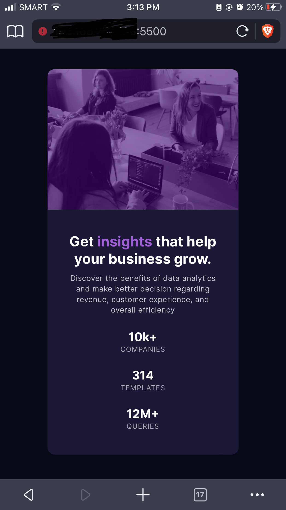

# Frontend Mentor - Stats Preview Card Component

This is a solution to the [Stats preview card component challenge on Frontend Mentor](https://www.frontendmentor.io/challenges/stats-preview-card-component-8JqbgoU62). <br>
Frontend Mentor challenges help you improve your coding skills by building realistic projects. 

## Table of contents:

- [Overview](#overview)
  - [The challenge](#the-challenge)
  - [Screenshot](#screenshot)
  - [Links](#links)
- [My process](#my-process)
  - [Built with](#built-with)
  - [What I learned](#what-i-learned)
  - [Continued development](#continued-development)
- [Author](#author)
- [Acknowledgments](#acknowledgments)
- [Feedback/Suggestions](#feedback--suggestions)
- [Notes](#notes)


## Overview:

### The challenge:

Users should be able to:
- View the optimal layout depending on their device's screen size
- Get it looking as close to the design as possible.

### Screenshot:

<div align="center"> 

| Original View | 
|---------|
|  |

| Animated Preview | 
|---------|
|  |

<br>

**Note: I use 1 media query, so it only has 2 different view (Mobile & Desktop View)**
All viewports were included (except for the 4k view), in case the observer wishes to see the minor changes.

<br>

| Desktop View | Laptop View | Tablet View |
|---------|---------|---------|
|  |  |  |

| Mobile Large | Mobile Small (iPhone SE) | iPhone 8+ (Safari Browser) | iPhone 8+ (Brave Browser) |
|---------|---------|---------|---------|
|  |  |  | |

</div>

### Links:
- Live Site URL: [Website Link - Click Me](https://stats-prev-card-component.vercel.app/)
- Solution URL: [FrontEndMentor - Link](https://www.frontendmentor.io/solutions/responsive-stats-preview-card-component-gUacH6GQFK)

## My process:

### Built with:
- HTML5
- CSS3

### What I learned:

Recap over some of the major learnings while working through this project:
- Basic review of HTML & CSS
- CSS Flex Layout (I've been a little bit better in using it)

<br>

This code snippets/function, is what **I'm proud to accomplished**:

```css
.ctn-overlay,
.ctn-img::after{
	position: absolute;
} 

.ctn-overlay, .ctn-img{
	width: 540px;
	height: 400px; /* Static size sort of solve the problem */
	margin: 0;
	position: relative; 
	background-color: hsla(277, 100%, 24.5%, 0.57); /* Starting now: I'll always use hsl/hsla in colors*/
	z-index: 2; 
}
```

<br>

This code snippets/function, is what **I struggled and took time to solve**:
- The responsiveness of image container (If you could see, I didn't use an img tag)
- The overlay of image container + responsiveness

```css
.ctn-img::after{
  content: '';
	background-size: cover;
	width: 100%;
	height: 100%;
  position: absolute;
	background: url(images.jpg) no-repeat center center;
} /* The hardest part was combining the overlay and image responsively*/
```


### Continued development:
<hr>

#### Here are a few possible areas that could be added or improved in the HTML and CSS code provided:
1. **Accessibility:** - It could be more accessible to users with disabilities by:
    - Include appropriate ARIA attributes, alt text, and semantic HTML tags. 
      - Some of the semantic tag that i forgot to use:
        - < header > 
        - Extra: Better use of < section >
2. **Responsiveness:** - Using responsive design techniques and media queries for different screen sizes and devices.
3. **Browser Compatibility:** - Not all browsers support the same features and rendering of web pages from the CSS styles I used.
4. **Cleaner Maintainable Code** - Not quite sure about this one, but I'm sure that there is a much better/cleaner approach to do what I did.

## Author:
- Github - [@Iron-Mark](https://github.com/Iron-Mark)
- Frontend Mentor - [@Iron-Mark](https://www.frontendmentor.io/profile/Iron-Mark)

## Acknowledgments:
- I would like to acknowledge the hard work and dedication that I went into creating this website. 
- I am grateful for my friends and to those who motivate me push through and not settle in relaxation. 
- I hope that this website serves its intended purpose. Thank you!

## Feedback & Suggestions:
### Auto-Generated Report:
- Accessibility Report 
  - Section lacks heading. Consider using `h2`- `h6` elements to add identifying headings to all sections.
  - ```html
    <div>
      <section class="sub-ctn"></section>
    </div>
    ```
- HTML Validation
  - Page should contain a level-one heading 
  - `<html lang="en">`

<br>

### Community Feedback:
- **David Gichuru** • 170 [_(@dxiDavid)_](https://github.com/dxiDavid)
  - Make sure the title or main heading is contained in the `<h1> </h1>` tags 
    - to get rid of those warnings and improve accessibility then adjust the font size to fit the design.
  - As for the overlay, since there's no fancy animation going on in this situation, 
    - Just put the image in a div, set the background color to that overlay color, and then slightly reduce the opacity of the image.
    - ```html
      <div class="ctn-img">
        
      </div>
      ```
    - ```css
      .ctn-img {
        background-color: hsla(277, 100%, 24.5%, 0.57);
      }

      .ctn-image > img{
        filter:brightness(40%)
        filter:opacity(40%);
      }
      ```

<br>

  - You could also play around with other filters like brightness and saturation to get closer to the design. 
  - This will save you several lines of CSS code and markup. 
  - Just make sure the image fits in the div and you should be good.

<br>

### Next Action (Soon):
- [ ] Implement changes from community feedback
- [ ] TBA...

## Notes:
- I would be happy to recieve comments, criticism, and such that could improve the website:
  - Better way of doing this website
  - Cleaner Code
  - Better Practice/Approach of making this website.
- Feel free to approach and contact me :>
- _Finished Feb 4, 2022_ & _Updated Feb 12, 2023_
